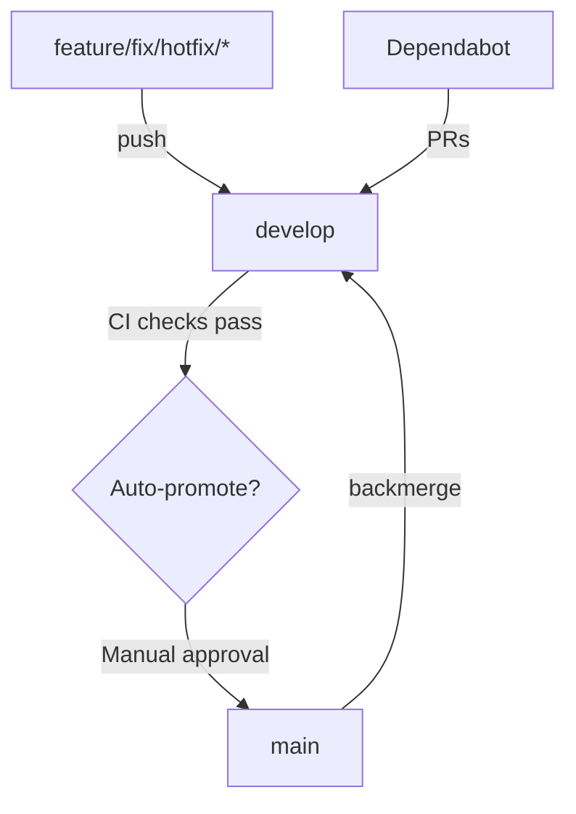

# 📋 Resumen Completo: Corrección de PRs y Workflows

**Estado**: snapshot histórico. Algunas afirmaciones pueden no reflejar el estado actual del repo.

## 🎯 Objetivo Inicial
Revisar y corregir 6 PRs de Dependabot con checks fallidos y configurar correctamente el GitFlow.

## ✅ Tareas Completadas

### 1. Configuración de Dependabot
- **Archivo**: `.github/dependabot.yml`
- **Estado actual**: NO HAY EVIDENCIA EN EL REPO de este archivo.
- **Nota**: Renovate está configurado en `renovate.json`.

### 2. Sincronización de Ramas
- Mergeada rama `main` → `develop` (10 commits de diferencia)
- Committeado cambio de configuración de Dependabot a `develop`
- Actualizada rama base de los 6 PRs: `main` → `develop`

### 3. Merge de PRs ✅
Todos los 6 PRs mergeados exitosamente a `develop`:

| PR | Cambio | Estado |
|----|--------|--------|
| #3 | actions/checkout v4 → v6 | ✅ Mergeado |
| #4 | actions/download-artifact v4 → v6 | ✅ Mergeado |
| #5 | actions/upload-artifact v4 → v5 | ✅ Mergeado |
| #1 | lewagon/wait-on-check-action 1.3.1 → 1.4.1 | ✅ Mergeado |
| #2 | anchore/scan-action 3 → 7 | ✅ Mergeado |
| #6 | ansible-lint <24.6 → <25.13 | ✅ Mergeado |

### 4. Actualización de Workflows
- **Problema identificado**: Los workflows seguían usando `@v4` después de mergear los PRs
- **Solución aplicada**: Actualización masiva de 9 workflows:
  - `actions/checkout@v4` → `@v6`
  - `actions/upload-artifact@v4` → `@v5`
  - `actions/download-artifact@v4` → `@v6`

**Workflows actualizados**:
1. ✅ branch-management.yml
2. ✅ ci-cd-enterprise.yml
3. ✅ ci-uv.yml
4. ✅ ci.yml
5. ✅ docker-test.yml
6. ✅ molecule-complete-stack.yml
7. ✅ quality-gates.yml
8. ✅ scorecard.yml
9. ✅ security-scan.yml

- **Validación**: Todos los archivos tienen sintaxis YAML válida ✓
- **Commit**: `f901954` en rama `develop`

## 📊 GitFlow Configurado



### Workflows de Branch Management

**Archivo**: `.github/workflows/branch-management.yml`

1. **Auto-merge to Develop**
   - Trigger: Push a feature/bugfix/hotfix
   - Acción: Crea PR hacia develop
   - Requiere: Aprobación manual

2. **Auto-promote to Main**
   - Trigger: Push a develop
   - Acción: Crea PR hacia main
   - Requiere: Aprobación manual

3. **Sync Main → Develop**
   - Trigger: Push a main
   - Acción: Backmerge automático de main a develop
   - Previene: Desincronización entre ramas

## 📈 Estado Actual

### Ramas
- **main**: `c2d8565`
- **develop**: `f901954` (9 commits adelante de main)
- **feature/top-0.01-percent**: `a5e7dc0`

### PRs
- **Abiertos**: 0
- **Mergeados hoy**: 6

### Workflows
- **Estado**: Ejecutándose en develop
- **Nota**: Algunos workflows pueden fallar por razones no relacionadas con las versiones de actions (ej: tests de Molecule requieren Docker)

## 🔍 Commits Relevantes en Develop

```bash
f901954 fix: merge workflow updates from feature branch
a5e7dc0 fix: update all workflows to use GitHub Actions v5/v6
1a50804 chore(deps): update ansible-lint (#6)
2a98362 chore(deps): bump anchore/scan-action (#2)
a06835d chore(deps): bump lewagon/wait-on-check-action (#1)
6c5283d chore(deps): bump actions/upload-artifact (#5)
6cbcac5 chore(deps): bump actions/download-artifact (#4)
4bd02f0 chore(deps): bump actions/checkout (#3)
9209e70 fix: configure Dependabot to target develop branch
```

## 🎯 Próximos Pasos

### Automático (ya configurado)
1. ✅ Futuros PRs de Dependabot apuntarán a `develop`
2. ✅ Workflows usarán versiones correctas de actions
3. ✅ Backmerge automático de main a develop funcionando

### Manual (recomendado)
1. ⏳ Revisar logs de workflows fallidos para identificar problemas no relacionados con actions
2. ⏳ Considerar si los tests de Molecule necesitan ajustes para CI
3. ⏳ Evaluar crear PR de develop → main cuando los checks pasen

## 📝 Notas Importantes

- **Problema de dependencia circular resuelto**: Los PRs de actions fallaban porque los workflows usaban las versiones antiguas. Esto se resolvió mergeando primero los PRs y luego actualizando los workflows.

- **GitFlow operativo**: El flujo está correctamente configurado según especificaciones:
  - feature → develop → main
  - Backmerge automático main → develop
  - Dependabot → develop

- **Workflows validados**: Todos los 9 workflows tienen sintaxis YAML válida y usan las versiones correctas de GitHub Actions.

---

**Fecha**: 2025-12-11
**Rama actual**: `develop`
**Último commit**: `f901954`
**Estado**: ✅ Configuración completada y operativa
