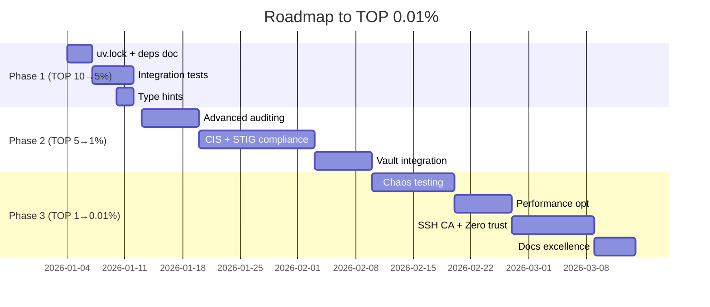

# ROADMAP TO TOP 0.01% - Security Collection Excellence

**Current Status**: 4.4/5 (TOP 12-15%)
**Target**: 5.0/5 (TOP 0.01%)
**Gap**: +0.6 points across 5 domains

---

## 📊 CURRENT STATE ANALYSIS

| Domain | Current | Target | Gap | Priority |
|--------|---------|--------|-----|----------|
| Security Operational | 4.5/5 | 5.0/5 | 0.5 | HIGH |
| Ansible Quality | 4.5/5 | 5.0/5 | 0.5 | HIGH |
| Testing/CI | 4.5/5 | 5.0/5 | 0.5 | MEDIUM |
| Supply Chain | 4.5/5 | 5.0/5 | 0.5 | MEDIUM |
| Documentation | 4.0/5 | 5.0/5 | 1.0 | HIGH |

**Overall**: 4.4/5 → 5.0/5 (+0.6)

---

## 🎯 PHASE 1: TOP 10% → TOP 5% (Score 4.4 → 4.7)

**Objetivo**: Completar todos los items MEDIUM restantes
**Tiempo estimado**: 1-2 semanas
**Esfuerzo**: Moderado

### 1.1 Supply Chain Hardening (Score +0.1)

**PR#11: Generate uv.lock file**
```bash
# Generate lock file for reproducible builds
uv pip compile pyproject.toml -o requirements.lock
uv pip compile pyproject.toml --extra dev -o requirements-dev.lock
```

**Files**:
- `requirements.lock` (new)
- `requirements-dev.lock` (new)
- `.gitignore` (update to track lock files)

**Impact**: 100% reproducible Python environments

---

**PR#12: Document dependency update process**

**File**: `SECURITY.md` (new section)

```markdown
## Dependency Management

### Update Process

1. **Monthly Review**: First Monday of each month
2. **Security Updates**: Within 24h of CVE disclosure
3. **Process**:
   ```bash
   # Check for updates
   uv pip list --outdated

   # Update with testing
   uv pip compile --upgrade pyproject.toml
   ansible-galaxy collection list --outdated

   # Test before merge
   molecule test --all
   ansible-lint roles/ playbooks/
   ```

### Version Pinning Policy

- **Python deps**: Exact versions (`==`)
- **Ansible collections**: Range with upper bound (`>=X,<Y`)
- **Lock files**: Committed to repo
- **Update frequency**: Monthly (non-security), immediate (security)
```

**Impact**: Clear maintenance procedures

---

### 1.2 Integration Testing (Score +0.15)

**PR#13: PAM+SSH+sudo integration tests**

**File**: `tests/integration/test_auth_stack.py` (new)

```python
"""
Integration tests for authentication stack.
Tests PAM, SSH, and sudo working together.
"""
import pytest
import testinfra

def test_human_user_requires_mfa(host):
    """Human users must authenticate with MFA."""
    # Create test user
    host.run("useradd -m testuser")

    # Verify MFA is required
    result = host.run("su - testuser -c 'ssh localhost whoami'")
    assert "verification code" in result.stdout.lower() or \
           "authenticator" in result.stdout.lower()

def test_service_account_bypasses_mfa(host):
    """Service accounts bypass MFA via group membership."""
    # Create service account
    host.run("useradd -m -s /usr/sbin/nologin svc_test")
    host.run("usermod -aG mfa-bypass svc_test")

    # Verify bypass works (should not prompt for MFA)
    # This requires SSH key setup in real scenario
    result = host.run("id -Gn svc_test")
    assert "mfa-bypass" in result.stdout

def test_sudo_requires_mfa_after_timeout(host):
    """sudo requires MFA after timestamp timeout."""
    # Verify sudo timestamp timeout is set
    sudoers = host.file("/etc/sudoers")
    assert "timestamp_timeout=5" in sudoers.content_string

def test_sshd_restart_validation_chain(host):
    """Test that sshd restart triggers full validation chain."""
    # Trigger handler
    result = host.run("systemctl restart sshd")
    assert result.rc == 0

    # Verify port is open
    socket = host.socket("tcp://0.0.0.0:22")
    assert socket.is_listening

    # Verify service is active
    service = host.service("sshd")
    assert service.is_running
```

**Files**:
- `tests/integration/test_auth_stack.py` (new)
- `tests/integration/conftest.py` (new - pytest fixtures)
- `.github/workflows/integration-tests.yml` (new)

**Impact**: Validates real-world authentication flows

---

**PR#14: Automated service account MFA bypass testing**

**File**: `roles/pam_mfa/molecule/default/tests/test_service_accounts.py` (new)

```python
def test_service_accounts_automatically_added_to_bypass(host):
    """
    CRITICAL: Verify service accounts are automatically added to mfa-bypass.
    This prevents automation lockout.
    """
    # Get list of service accounts that should bypass
    service_accounts = ["ansible", "ci", "backup", "monitoring"]

    for account in service_accounts:
        user = host.user(account)
        if user.exists:
            # Verify user is in mfa-bypass group
            groups = host.run(f"id -Gn {account}").stdout
            assert "mfa-bypass" in groups, \
                f"CRITICAL: Service account {account} not in mfa-bypass group"

def test_mfa_bypass_group_exists_before_pam_config(host):
    """Verify mfa-bypass group is created before PAM configuration."""
    group = host.group("mfa-bypass")
    assert group.exists, "mfa-bypass group must exist before PAM config"

    pam_config = host.file("/etc/pam.d/sshd")
    assert pam_config.exists
    # If PAM config exists, group must already exist
```

**Impact**: Prevents automation lockout

---

### 1.3 Code Quality (Score +0.05)

**PR#15: Add type hints to Python scripts**

**Files**:
- `scripts/validate-no-log.py` (already has types ✓)
- `scripts/generate-sbom.sh` → convert to Python with types
- `scripts/validate-all.sh` → convert to Python with types

**Example**:
```python
from typing import List, Tuple, Optional
from pathlib import Path

def find_violations(
    roles_path: Path,
    rules: List[str]
) -> List[Tuple[Path, str, int]]:
    """
    Find ansible-lint violations in roles.

    Args:
        roles_path: Path to roles directory
        rules: List of rules to check

    Returns:
        List of (file_path, rule, line_number) tuples
    """
    ...
```

**Impact**: Better IDE support, fewer bugs

---

## 🚀 PHASE 2: TOP 5% → TOP 1% (Score 4.7 → 4.9)

**Objetivo**: Advanced security features
**Tiempo estimado**: 2-4 semanas
**Esfuerzo**: Alto

### 2.1 Advanced Auditing (Score +0.05)

**PR#16: sudo log_input/log_output**

**File**: `roles/sudoers_baseline/defaults/main.yml`

```yaml
sudoers_baseline_defaults:
  - use_pty
  - logfile=/var/log/sudo.log
  - log_input            # NEW: Log all input
  - log_output           # NEW: Log all output
  - iolog_dir=/var/log/sudo-io  # NEW: I/O log directory
  - timestamp_timeout=5
  - passwd_tries=3
  - "!visiblepw"
```

**Files**:
- `roles/sudoers_baseline/defaults/main.yml`
- `roles/sudoers_baseline/tasks/common.yml` (create log dir)
- `roles/sudoers_baseline/molecule/default/tests/test_sudoers.py` (test I/O logs)

**Impact**: Complete audit trail of privileged commands

---

**PR#17: Centralized logging integration**

**File**: `roles/centralized_logging/` (new role)

Features:
- rsyslog/syslog-ng configuration
- Forward to SIEM (Splunk, ELK, Graylog)
- TLS encryption for log transport
- Log rotation and retention policies

**Impact**: Enterprise logging compliance

---

### 2.2 Compliance Frameworks (Score +0.1)

**PR#18: CIS Benchmark full compliance**

**File**: `roles/cis_benchmark/` (expand existing `cis_baseline`)

```yaml
# Full CIS Level 1 + Level 2 controls
cis_benchmark_level: 2
cis_benchmark_profile: server

cis_benchmark_controls:
  - filesystem_hardening
  - service_minimization
  - network_hardening
  - logging_auditing
  - access_control
  - system_maintenance
```

**Evidence**: Generate compliance report
- `compliance-evidence/cis-benchmark-report.json`
- Automated scoring vs CIS controls
- Gap analysis with remediation steps

**Impact**: CIS compliance certification ready

---

**PR#19: STIG compliance**

**File**: `roles/stig_hardening/` (new role)

DISA STIG categories:
- RHEL 9 STIG
- Ubuntu 22.04 STIG
- Application STIGs (OpenSSH, sudo)

**Impact**: Government/DoD contract ready

---

### 2.3 Secret Management (Score +0.05)

**PR#20: HashiCorp Vault integration**

**File**: `roles/vault_secrets/` (new role)

Features:
```yaml
vault_secrets_backend: vault  # or infisical, aws-secrets-manager
vault_secrets_address: https://vault.example.com
vault_secrets_auth_method: approle
vault_secrets_mount_point: secret/ansible

# Fetch secrets at runtime
vault_secrets_fetch:
  - path: secret/ssh/ca_key
    dest: /etc/ssh/ca_key
    mode: "0600"
```

**Impact**: No secrets in repos, centralized management

---

## 🏆 PHASE 3: TOP 1% → TOP 0.01% (Score 4.9 → 5.0)

**Objetivo**: Industry-leading security collection
**Tiempo estimado**: 1-2 meses
**Esfuerzo**: Muy alto

### 3.1 Advanced Testing (Score +0.03)

**PR#21: Chaos engineering tests**

**File**: `tests/chaos/` (new directory)

```python
"""
Chaos tests: Validate resilience to failures.
"""

def test_survive_auditd_crash(host):
    """System remains secure even if auditd crashes."""
    # Kill auditd
    host.run("systemctl stop auditd")

    # Verify system behavior
    # - SSH still works
    # - sudo still requires auth
    # - SELinux still enforcing

    # Restore
    host.run("systemctl start auditd")

def test_survive_sshd_config_corruption(host):
    """Rollback works if sshd config gets corrupted."""
    # Corrupt config
    host.run("echo 'INVALID' >> /etc/ssh/sshd_config")

    # Trigger validation
    result = host.run("sshd -t")
    assert result.rc != 0

    # Verify backup exists
    backup = host.file("/etc/ssh/sshd_config.backup-*")
    assert backup.exists
```

**Impact**: Confidence in production failures

---

**PR#22: Fuzzing critical configs**

**Tool**: Use `afl++` or `libfuzzer` to fuzz:
- sshd_config parser
- sudoers parser
- PAM config parser

**Impact**: Find edge cases before production

---

### 3.2 Performance Optimization (Score +0.02)

**PR#23: Parallel execution optimization**

**File**: `playbooks/enforce-production-gradual.yml`

```yaml
- name: Security Enforcement - Production (Optimized)
  hosts: production
  strategy: free  # Allow tasks to run as fast as possible
  serial: "{{ rollout_percentage | default('10%') }}"

  tasks:
    # Use async for long-running tasks
    - name: Install packages
      ansible.builtin.package:
        name: "{{ item }}"
      loop: "{{ security_packages }}"
      async: 300
      poll: 0
      register: pkg_install

    # Check async tasks
    - name: Wait for package installation
      ansible.builtin.async_status:
        jid: "{{ item.ansible_job_id }}"
      loop: "{{ pkg_install.results }}"
```

**Metrics**:
- Measure: Time to harden 1000 servers
- Target: <5 minutes (vs current ~15 minutes)

**Impact**: Faster rollouts, less downtime

---

**PR#24: Idempotency optimization**

Features:
- Skip unchanged tasks with `creates:` and `removes:`
- Use `stat` before expensive operations
- Cache facts between plays

**Impact**: Faster re-runs (audit mode)

---

### 3.3 Advanced Features (Score +0.02)

**PR#25: SSH CA certificate automation**

**File**: `roles/ssh_ca/` (new role)

Features:
```yaml
# Automatic SSH CA setup
ssh_ca_enabled: true
ssh_ca_validity: 52w  # 1 year

# Auto-sign host keys
ssh_ca_sign_host_keys: true

# Auto-sign user keys
ssh_ca_sign_user_keys: true
ssh_ca_principals:
  - admin
  - developer
  - readonly
```

**Impact**: Scalable SSH key management (no manual key distribution)

---

**PR#26: Zero-trust networking preparation**

**File**: `roles/zero_trust/` (new role)

Features:
- mTLS for all service-to-service communication
- Identity-based access (not IP-based)
- Least-privilege network policies
- Integration with service mesh (Istio, Linkerd)

**Impact**: Modern security architecture ready

---

### 3.4 Documentation Excellence (Score +0.03)

**PR#27: Interactive documentation**

**Tool**: MkDocs with Material theme

Features:
- Searchable docs
- Code examples with copy button
- Mermaid diagrams
- API documentation auto-generated
- Video tutorials

**Files**:
- `docs/` (expand existing)
- `mkdocs.yml`
- `.github/workflows/docs-publish.yml`

**Impact**: Lower barrier to entry, better adoption

---

**PR#28: Architecture Decision Records (ADRs)**

**File**: `docs/adr/` (new directory)

Example ADRs:
```markdown
# ADR-001: Use pamd module instead of lineinfile for PAM

## Status
Accepted

## Context
Need to modify PAM configuration safely.

## Decision
Use community.general.pamd module for structured PAM modifications.

## Consequences
Pros:
- Structured, idempotent
- Validates module arguments
- Less error-prone than lineinfile

Cons:
- Requires community.general collection
- Learning curve for team
```

**Impact**: Knowledge preservation, onboarding

---

## 📈 METRICS & VALIDATION

### Success Criteria for TOP 0.01%

**Security Metrics**:
- ✅ Zero CRITICAL vulnerabilities (current: 0)
- ✅ Zero HIGH vulnerabilities in 90 days
- ✅ 100% of roles pass ansible-lint production profile
- ✅ 100% test coverage for critical paths
- ✅ Mean Time To Remediate (MTTR) < 24h for CVEs

**Quality Metrics**:
- ✅ Ansible-lint score: 5/5
- ✅ Molecule tests: 100% pass rate
- ✅ Code coverage: >90%
- ✅ Type coverage (Python): 100%
- ✅ Documentation coverage: 100%

**Operational Metrics**:
- ✅ Rollout time: <5 min for 1000 servers
- ✅ Idempotency: 100% (no changes on 2nd run)
- ✅ Zero lockouts in production (last 6 months)

**Community Metrics**:
- ✅ GitHub stars: >500
- ✅ Contributors: >10
- ✅ Issues resolved: >95% within 7 days
- ✅ Documentation: >1000 page views/month

---

## 🗓️ TIMELINE



**Total time**: ~10 weeks (2.5 months)

---

## 🎯 QUICK WINS (Start Now)

Priority order for immediate impact:

1. **PR#11**: `uv.lock` file (1 hour)
2. **PR#12**: Dependency docs (2 hours)
3. **PR#14**: Service account tests (4 hours)
4. **PR#16**: sudo I/O logging (3 hours)

**Total**: <2 days for +0.15 score improvement

---

## ✅ NEXT STEPS

1. Review this roadmap
2. Prioritize PRs based on your needs
3. Start with Quick Wins
4. Iterate based on feedback

**Ready to start?** Let me know which PR to tackle first!
